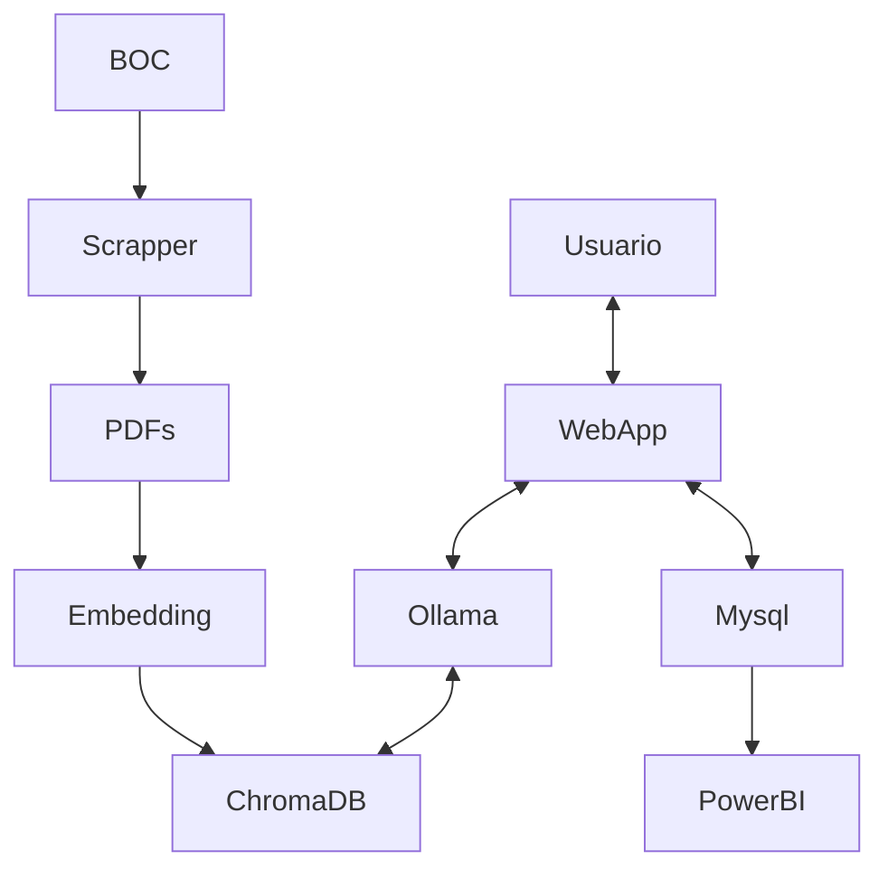

# Reto ChatBOC - Equipo A

ChatBOC es un chatbot diseñado para brindar asistencia y responder preguntas relacionadas con la normativa legal del Boletín Oficial de Cantabria (BOC). Utiliza modelos de lenguaje para comprender y responder consultas de los usuarios de manera efectiva.

## Curso de Especialización en Inteligencia Artificial y Big Data

## 2023 - 2024

### Tareas a Realizar

- **Desarrollar un chatbot** capaz de comprender y responder preguntas sobre el BOC utilizando modelos de lenguaje.

- **Implementar un sistema de scraping** para recopilar y estructurar la información del BOC en un formato accesible para el chatbot.

- **Diseñar una interfaz de usuario** intuitiva para el ChatBOC y un panel de control en Power BI para visualizar estadísticas y métricas relevantes.

- **Realizar scraping diario** para mantener actualizada la base de datos del chatbot con las últimas normativas publicadas en el BOC.

## Tecnologías y Herramientas

- **Lenguajes de Programación**: Python

- **Frameworks y Librerías**: LangChain, Ollama

- **Herramientas de Desarrollo**: Git, GitHub, Visual Studio Code

- **Plataformas**: Power BI

- **Otros**: APIs de procesamiento de lenguaje natural (NLP)

## Equipo

- **José Ramón Blanco Gutiérrez (Coordinador)**

- **Aarón Saiz Guerra (Portavoz)**

- **Manolo Corte Salazar (Secretario)**

- **Iosu Ramos Martínez (Desarrollador)**

- **Juan Carlos González Fernández (Desarrollador)**

## Instalación y Uso
Exisen dos formas de despliegue disponibles, virtualizado en Docker o una ejecución local. 
A continuación se explican ambas. 

## Descripción de los directorios
app -> Estan las diferentes aplicaciones listas para usar
src -> El codigo fuente de todas las clases y app (NO FUNCIONA EJECUTAR)

### Despliegue en Docker

### Requisitos Previos
1. Docker y sus dependencias
2. Python3 

### Modo de despliegue
Para realizar un despliegue virtualizado en tu entorno, has de clonar este repositorio en el mismo y a continuación dirigirte a /despliegues y ejecutar "python levantar.py"
Una opción alternativa es simplemente descargarte la carpeta "despliegues" y proceder de la misma manera. Es suficiente. 

1. git clone https://github.com/mcortes027/reto_ceiabd.git
2. python reto_ceiabd/despliegues/levantar.py 

### Despliegue sin virtualización 
Para realizar un despliegue no virtualizado en tu entorno, has de clonar este repositorio en el mismo y a continuación realizar los pasos detallados más abajo, comenzando por los requisitos. 

### Requisitos Previos
1. Docker y sus dependencias
2. Python3
3. Instalar los requisitos (en la raiz de este repositorio)
   - git clone https://github
   - .com/mcortes027/reto_ceiabd.git
   - cd reto_ceiabd

